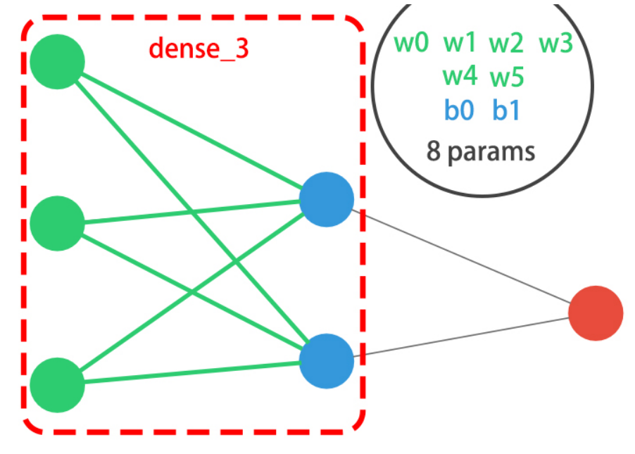
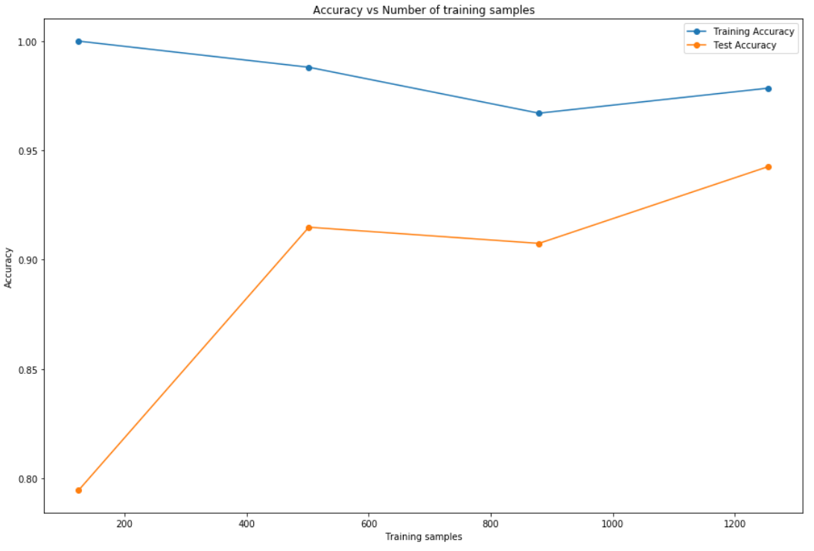

# Introdução ao Deep Learning com Keras
Autor: Eduardo AV de Salis
Meterial de estudos:  
* DataCamp
* Hands-On Machine Learning with Scikit-Learn, Keras, and TensorFlow
* outros
---
# Conceitos básicos e Revisão
---
# Keras
* Framework para deep learning
* Uso de menos código
* Acessível para iniciantes
* É possível construir várias arquiteturas
    * Simples
    * Auto encoders
    * CNNs
    * RNNs
* Integrada com Tensorflow 2.0
* etc

---

# Redes Neurais
* Lidam com relações não lineares entre os dados
* Conseguem extrair atributos dos dados, evidenciando muito bem suas interações
    * Basicamente fazem o processo de _feture engineering_ sozinhas  
* Podemos (devemos) utilizar Redes neurais quando não precisamos "interpretar os resultados"
    * Exemplo: dados não estruturados (som, imagens, vídeos)

---
# Representações


---


---
# Construindo uma rede neural básica
```python
#Pacotes
from tensorflow.keras.models import sequential
from tensorflow.keras.layers import Dense
#Instanciando um modelo sequencial
model = Sequential()
#Adicionando uma camada inicial - necessário passar o formato dos inputs 
model.add(Dense(2, activation='relu', input_shape=(3,)))

#aqui poderíamos adicionar mais camadas

#Adicionando camada final (output)
model.add(Dense(1))
# Resumindo o modelo (parêmtros , camadas, etc.)
model.summary()
```
---


---

# Compilação, treino, teste, avaliação
```python
#Compilação
model.compile(optimizer='adam', loss = 'mse')

#Treino
model.fit(X_train, y_train, epochs=5)

#Obtendo a previsão
preds = model.predict(X_test) 

#Avaliando o modelo com o conjunto de teste
model.evaluate(X_test,y_test)

```
---
# Conceitos
* __função ativadora__
* __otimizadores__
* __epochs__
* __loss function__

---
# Classificação Binária
## Conceito:
Problemas que envolvam a necessidade  de prever se uma observação se encontra em uma de duas classes
## Detalhes da Estutura:
Input layer -> Hidden layers -> Output 
* Para o output era necessário a função ativadora sigmoid
* sigmoid aproxima a saída do neurônio para um número entre 0 e 1
* quando usamos a sigmoid na saída, temos que usar a Binary cross-entropy como loss function
---
# Código
```python

from tensorflow.keras.models import Sequential
from tensorflow.keras.layers import Dense

#arquitetura
model = Sequential()
model.add(Dense(4, activation='relu', input_shape=(2,), activation='tahn'))
model.add(Dense(1))

#compilando, treino, e previsão
model.compile(optimizer='sgd', loss = 'binary_crossentropy')
model.train(coordinates, labels, epochs=20)
preds = model.predict(coordinates)

```
---
# Classificação multi-classe
## Conceito:
Problemas que envolvam a necessidade  de prever se uma observação se encontra em uma de várias classes
## Detalhes da Estutura:
Input layer -> Hidden layers -> Output 
* Input shape: número de preditores 
* Um output para cada possibilidade de classificação
* Soma das probabilidades de cada categoria tem q ser igual a 1 -> usamos "softmax" como ativadora
* Loss: Categorical cross-entropy

---
# Observação: necessário prepar o dataset
Presença de variáveis categoórigas -> necessário preprocessamento
```python
import pandas as pd
from keras.utils import to_categorical

df = pd.read_csv('data.csv')

df.response = pd.Categorical(df.response)
df.response = df.response.cat.codes
y = to_categorical(df.response)
```
---
# Multi-label 
## Conceito:
Uma observação pode ser designada à mais de uma classe


---

## Detalhes da Estutura: 
* activation: sigmoid
* loss: Binary cross-entropy
    *  Justificativa: compilamos uma série de classificações binárias 
* Referência: https://gombru.github.io/2018/05/23/cross_entropy_loss/

---
# Keras callbacks
## Conceito de callback: 
* Função de respota a algo ( outra função , evento, tarefa)
* No keras: código executado depois de cada época (epochs) durante ou após o treino
* São úteis para guardar métricas e fazer decisões conforme o modelo "aprende"

---
# Código
```python
# há um objeto callback toda vez que treinamos um modelo
history = model.fit(X_train,y_train, epohcs=100, 
                validation_data=(X_test,y_test),
                metrics=['accuarcy'])
#O objeto é um dicionário, podemos acessar informações pelas suas chaves 

#perda e acurácia do treino
print(history.history['loss'])
print(history.history['acc'])

#perda e acurácia da validação
print(history.history['val_loss'])
print(history.history['val_acc'])
```


---


---
# Interpretação
* Quando as curvas do treino e da validação começam a divergir, é sinal de overfitting (acurácia aumentando no treino e diminuindo no teste conforme passam as épocas)

---
# Early stopping
* Ferramenta para evitar o overfitting
* Para de treinar quando não melhora mais o modelo
* Útil quando não sabemos a qauntidade de épocas 
## Código
```python
from keras.callbacks import EarlyStopping

#podemos definir outras medidas para monitorar
# o grau de paciência é subjetivo, devemos evitar valores baixos
early_stopping = EarlyStopping(monitor='val_loss', patience=5)
model.fit(X_train,y_train, epohcs=100, 
                validation_data=(X_test,y_test),
                metrics=['accuarcy'],
                callbacks= [early_stopping])

```

---
# Learning Curves 
---
# 



---
```{python}
for size in training_sizes:
    
    # Separa em partes os dados de treino
    X_train_frac, y_train_frac = X_train[:size], y_train[:size]

    # Restaura o modelp
    model.set_weights(initial_weights)
    model.fit(X_train_frac, y_train_frac, epochs = 50, callbacks = [early_stop])

    # Avalia a fração de dados do treino e o resultado dos testes
    train_accs.append(model.evaluate(X_train_frac, y_train_frac)[1])
    test_accs.append(model.evaluate(X_test, y_test)[1])
    
# Plot train vs test accuracies
plot_results(train_accs, test_accs)
```

----
# Ativadores
* Realiza uma modificação no valor obtido no "neurônio" (inputs * pesos conexão + viés)
* Funçoes ativadores causam impacto no tempo de aprendizado, na acurácia e na fronteira de classificação
* Exememplos:
    * Sigmoid: transforma em um número entre 0 e 1
    * Tanh (Hyperbolic tangent): transforma em um número entre -1 e 1
    * ReLU (Rectified linear unit): transforma em um número entre 0 e infinito. Há uma versão que suaviza o ReLU e permite números negativos 
* Difícil determinar a melhor:
    * Depende do objetivo
    * ReLU treina mais rápido e generaliza melhor

---
## Testando diferentes funções
``` python
# Funções de ativação para testar
activations = ['relu', 'leaky_relu', 'sigmoid', 'tanh']

# Loop 
activation_results = {}

for act in activations:
  # Novo modelo com nova função
  model = get_model(act)
  # treianr o modelo e guardar o histórico
  h_callback = model.fit(X_train,y_train, epochs=20, validation_data=(X_test,y_test), verbose=0)
  activation_results[act] = h_callback 
```

---
## Comparado desempenho
``` python
# DataFrame para compração da perda
val_loss= pd.DataFrame(val_loss_per_function)

# plotar o gráfico da loss func.
val_loss.plot()
plt.show()

# DataFrame para compração da acurácia
val_acc = pd.DataFrame(val_acc_per_function)

# plotar o gráfico da loss acc
val_acc.plot()
plt.show()
```

---
# Batch e batch normalization

* Mini-bach: amostra de exemplos de dados
* Uma maneira de atualizar os pesos (variação do Gradient Descendent), separa os dados em diferentes amostras, calcula o erro e atualiza o modelo
* Vantagens:
    * +rápido (+ mais atualização de pesos em um mesmo tempo)
    * -RAM requerida
    * ruído ajuda a identificar o "local minima"
* Desvantagens
    * +iterações necessárias
    * precisamos ficar testando diferentes tamanhos de batchs
* Definimos a quantidade de batchs no treino (model.fit(X_train, y_train, epochs=5, batch_size=1))

----
# Batch Normalization
* Normalização melhora o modelo
* Batch Normalization garante que  os inoputs da próxima camada são normalziados
* Aplicamos como uma camada
```{python}
from keras.layers import BatchNormalization
...
model.add(BatchNormalization())
...
```

----

# Hyperparameter tuning
* Temos que decidir
    * N de camadas
    * N de neurônios por camada
    * Ordem das camadas
    * Ativadores
    * Tamanho de batchs
    * Taxa de aprendizado
    * Otimizadores

----
* É um processo que demanda computação
* Random Search > Grid Search
* Melhor não usar muitas _epochs_
* Usar menores amostras do dataset

---

```{python}
# Creates a model given an activation and learning rate
def create_model(learning_rate, activation):
  
  	# Create an Adam optimizer with the given learning rate
  	opt = Adam(lr = learning_rate)
  	
  	# Create your binary classification model  
  	model = Sequential()
  	model.add(Dense(128, input_shape = (30,), activation = activation))
  	model.add(Dense(256, activation = activation))
  	model.add(Dense(1, activation = 'sigmoid'))
  	
  	# Compile your model with your optimizer, loss, and metrics
  	model.compile(optimizer = opt, loss = activation, metrics = ['accuracy'])
  	return model
	  
```

---

```{python}
# Creates a model given an activation and learning rate
def create_model(learning_rate, activation):
  
  	# Create an Adam optimizer with the given learning rate
  	opt = Adam(lr = learning_rate)
  	
  	# Create your binary classification model  
  	model = Sequential()
  	model.add(Dense(128, input_shape = (30,), activation = activation))
  	model.add(Dense(256, activation = activation))
  	model.add(Dense(1, activation = 'sigmoid'))
  	
  	# Compile your model with your optimizer, loss, and metrics
  	model.compile(optimizer = opt, loss = activation, metrics = ['accuracy'])
  	return model
	  
```

---

```{python}
# Import KerasClassifier from keras scikit learn wrappers
from keras.wrappers.scikit_learn import KerasClassifier

# Create a KerasClassifier
model = KerasClassifier(build_fn = create_model)

# Define the parameters to try out
params = {'activation': ['relu', 'tanh'], 'batch_size': [32, 128, 256], 
          'epochs': [50, 100, 200], 'learning_rate': [0.1, 0.01, 0.001]}

# Create a randomize search cv object passing in the parameters to try
random_search = RandomizedSearchCV(model, param_distributions = params, cv = KFold(3))

# Running random_search.fit(X,y) would start the search,but it takes too long! 
show_results()
	  
```
----
# Cross - val

```{python}
# Import KerasClassifier from keras wrappers
from keras.wrappers.scikit_learn import KerasClassifier

# Create a KerasClassifier
model = KerasClassifier(build_fn = create_model(learning_rate = 0.001, activation = 'relu'), epochs = 50, 
             batch_size = 128, verbose = 0)

# Calculate the accuracy score for each fold
kfolds = cross_val_score(model, X, y, cv = 3)

# Print the mean accuracy
print('The mean accuracy was:', kfolds.mean())

# Print the accuracy standard deviation
print('With a standard deviation of:', kfolds.std())
	  
```

---

# Diferentes arquiteturas
* ##  Autoencoder
* ##  CNN
* ##  LTSM